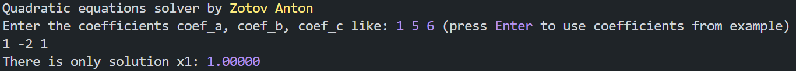
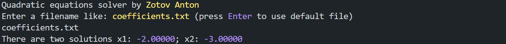
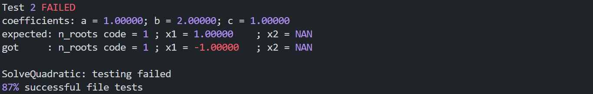
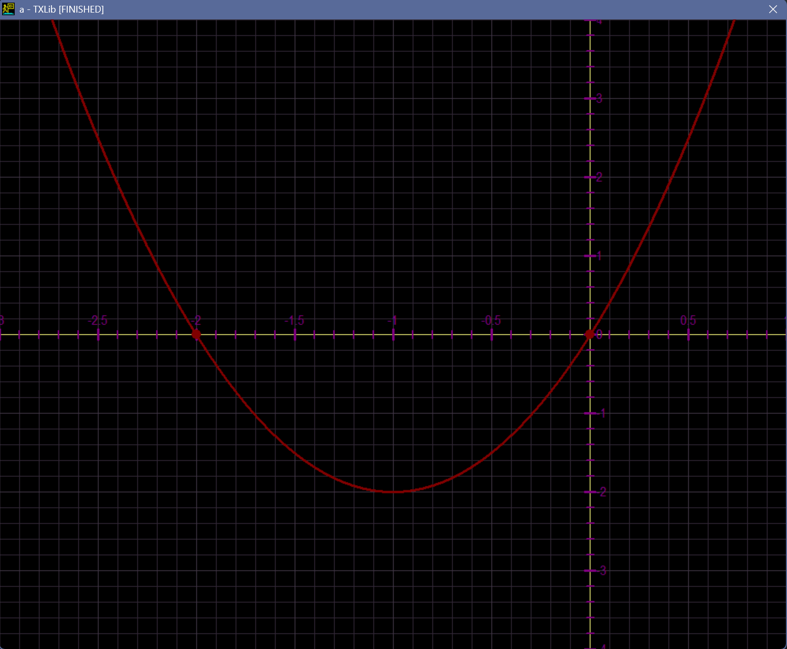

<<h2 align="center"> quadratic equations </h2>

---

#### table of contents

* [overview](#overview)
* [features](#features)
* [demonstration](#demonstration)
* [option management](#usage)
* [used tools](#libraries)
* [to do](#todo)

---

#### overview

This program is designed to solve quadratic equations. User has to provide coefficients of quadratic equation to the program, and it outputs the roots.

---

#### features

* The program supports input from the console and from file. You can set the mod by command line flag (hereinafter referred to as CLF) or the program ask you about it at runtime.
* The program capable of printing with a typewriter effect.
* It is possible to conduct testing of function that calculate the roots at start of program launch. Failed tested are put in file with failed tests.
* Contains a function that plots a graph of a quadratic equation.
* Supports color printing.

---

#### demonstration

* __console input__

* __file input__

* __testing__ (expected value in example is incorrect)

* __graphic__

---

#### option management

__launch__
User has to compile "___main.c___" by __c++__ compiler and run resulting file to launch the program.

__program options__
* Use CLF ___-c___ or ___-f___
to set console or file input respectively.
if you specify both flags program will ask you to set input at runtime.
* Use CLF ___-a___
to activate printing with typewriter effect.
* Use CLF ___-t___
to conduct preliminary testing using tests from file specified by macro ___TESTFILE___ and put failed tests in file specified by macro ___FAILED_TESTS_FILE___.
* Use CLF ___-g___
to see a graphic of the quadratic equation with entered coefficients at the end.
* Change value of macro ___COLOR_SWITCH___ to ___ON___ or ___OFF___ to switch color printing

__for developers__
all functions are documented using _doxygen_ syntax in the file "___title.c___"

---

#### used tools

__libraries__
The following __C/C++__ libraries were used in the program

* [__TXLib.h__](http://storage.ded32.net.ru/Lib/TX/TXUpdate/Doc/HTML.ru/)
for graphic (all _tx_-functions)
* __stdio.h__
for basic functions (_printf_, _fopen_, etc.)
* __stdlib.h__
for basic functions (_calloc_)
* __string.h__
for work with strings (_strncpy_)
* __math.h__
for mathematical operations (_sqrt_)
* __ctype.h__
for work with symbols (_isalpha_, etc.)

---

#### to do

* Don't stop the program in case of an error but remember the error and return bit number containing information about all the error incidents
* Add arguments to certain flags where appropriate
* Clear output
* Add ability to skip slow output (typewriter effect)
